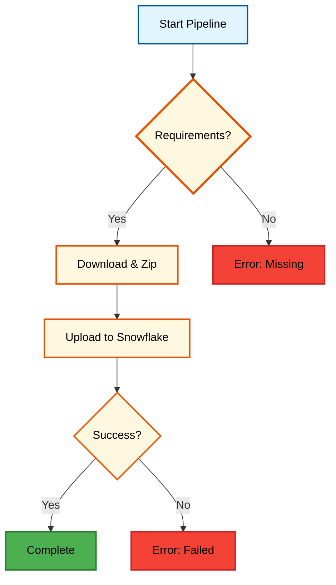

# Snowflake Package Sync Pipeline

A comprehensive tool for automating the synchronization of Python packages from ProGet/PyPI to Snowflake internal stages.

## Table of Contents
- [Overview](#overview)
- [Setup](#setup)
- [Usage](#usage)
- [Development](#development)
- [API Reference](#api-reference)
- [CI/CD Integration](#cicd-integration)

## Overview
This pipeline script orchestrates the secure transfer of Python dependencies into Snowflake's environment. It ensures that your Snowflake User Defined Functions (UDFs) and Stored Procedures have access to the exact package versions required by your application.

The process involves:
1.  Downloading packages from a specified source (ProGet or PyPI).
2.  Packaging them into a compatible ZIP archive.
3.  Uploading the archive to a designated Snowflake internal stage.



## Setup

### Prerequisites
- Python 3.8 or higher
- Access to a Snowflake account with `PUT` permissions on the target stage
- Network access to the package repository (ProGet or PyPI)

### Installation

1.  Clone the repository containing this script.
2.  Install the required dependencies:

    ```bash
    pip install -r requirements.txt
    ```

3.  Configure the environment variables for Snowflake authentication:
    - `SNOWFLAKE_ACCOUNT`
    - `SNOWFLAKE_USER`
    - `SNOWFLAKE_PASSWORD`
    - `SNOWFLAKE_ROLE` (Optional)
    - `SNOWFLAKE_WAREHOUSE` (Optional)
    - `SNOWFLAKE_DATABASE` (Optional)
    - `SNOWFLAKE_SCHEMA` (Optional)

## Usage

Run the script from the command line, providing the necessary arguments.

### Basic Example

```bash
python sync_snowflake_packages.py --stage @MY_DB.MY_SCHEMA.PACKAGES_STAGE
```

### With Custom Requirements and ProGet Source

```bash
python sync_snowflake_packages.py \
    --requirements production-requirements.txt \
    --stage @MY_DB.MY_SCHEMA.PROD_STAGE \
    --proget-url https://proget.example.com/pypi/my-feed/simple \
    --zip-name release_v1.zip
```

## Development

### Testing

This project uses `unittest` for testing. The tests mock external dependencies (Snowflake, ProGet) to ensure the logic can be verified without a live environment.

To run the tests:

```bash
python3 -m unittest discover tests
```

## API Reference

### CLI Arguments

The script accepts the following command-line arguments:

- `--requirements`: Path to the requirements file listing packages to sync. Defaults to `requirements.txt`.
- `--stage`: **(Required)** The target Snowflake stage identifier (e.g., `@DATABASE.SCHEMA.STAGE`).
- `--download-dir`: The temporary directory to store downloaded packages before zipping. Defaults to `./downloaded_packages`.
- `--zip-name`: The name of the resulting ZIP file. Defaults to `app_packages.zip`.
- `--proget-url`: The URL of the package repository (e.g., ProGet feed). If omitted, `pip` uses the default configuration.

## CI/CD Integration

This project is configured for **Azure DevOps**.

### Azure DevOps Pipeline
See `azure-pipelines.yml`.
- The pipeline triggers on changes to `requirements.txt` or the `main` branch.
- It installs dependencies and runs the sync script.

**Configuration Required:**
Define the following variables in your Azure DevOps Pipeline Library or Variable Group (mark sensitive ones as secrets):
- `SNOWFLAKE_ACCOUNT`
- `SNOWFLAKE_USER`
- `SNOWFLAKE_PASSWORD`
- `SNOWFLAKE_ROLE`
- `SNOWFLAKE_WAREHOUSE`
- `SNOWFLAKE_DATABASE`
- `SNOWFLAKE_SCHEMA`
- `PROGET_URL`